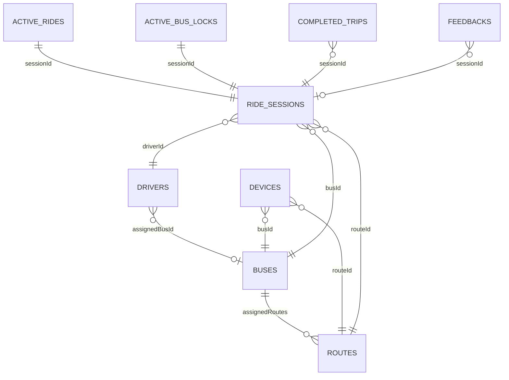

# Firebase Firestore and RTDB data model

## Reading this document

Firestore is durable/queryable; RTDB is the low-latency latest-state projection. `server` means Firebase Admin SDK and therefore not governed by client rules. Timestamps are called out because this repository contains both Firestore `Timestamp`, ISO strings, RTDB server milliseconds and epoch-millisecond numbers.

Access model: client-facing Firestore and RTDB rules require authentication and enforce least-privilege roles. App Check is enforced for both products through Firebase Console; it is not available as a Firestore Security Rules request field. Server/Admin SDK writes bypass rules. The emulator integration suite uses isolated copies of the deployed rules (`scripts/rules-for-emulator.mjs`).

## RTDB

### `activeBuses/{busId}_{routeId}`

One latest projection per assigned bus/route. The key is an internal composite locator; consumers use stored `busId` and `routeId` and must not split the key because IDs can contain underscores. A telemetry-created node represents device presence only and omits ride lifecycle fields. Passenger service exists only when the server-owned tuple `status: active` + non-empty `sessionId` + resolved `direction` + `tripState: pre_departure|in_service` is complete.

| Field | Type | Meaning/source |
|---|---|---|
| `busId` | string | Server registry assignment |
| `routeId` | string | Server registry/shift assignment |
| `lat`, `lng` | number | Latest accepted GNSS coordinate |
| `rawLocation` | object | Original authenticated `{lat,lng,speed,heading,gpsHdop,motionState,seq,sampledAt}`; never overwritten by snapping |
| `matchedLocation` | object | Current confident `{lat,lng,segmentIndex,segmentFraction,alongRouteDistanceM,distanceToRouteM,headingDifference,matchConfidence,seq,sampledAt,routeVersion}` |
| `mapMatchSeq`, `mapMatchSampledAt` | number | Sample identity of the latest completed matching pass, including passes that produced no confident match |
| `matchConfidence`, `distanceToActiveRoute` | number | Latest matcher confidence (0–1) and raw distance in metres |
| `routeState` | enum | `ON_ROUTE`, `POSSIBLE_OFF_ROUTE`, `OFF_ROUTE`, `REROUTING`, or `ON_NEW_ROUTE` |
| `activeRouteId` | string | Authoritative configured/dynamic matching-context label; route geometry is NOT on this hot node (see sibling store below) |
| `routeVersion`, `routeSource`, `routeDirection`, `routeSessionId` | number/string | Atomic live-route identity; version increments on session/direction/reroute changes |
| `routeGeometryVersion` | non-negative integer | Firestore configured-geometry revision used by this live context |
| `routeMatchHistory` | array | Bounded last four accepted points used to derive recent trajectory heading |
| `speed` | number | km/h, 0–200 |
| `heading` | number | degrees, 0–360 |
| `gpsHdop` | number/null | Receiver horizontal dilution of precision; null for staged legacy firmware |
| `motionState` | `moving` / `stopped` / `uncertain` | Firmware; uncertain means trustworthy GNSS lost |
| `timestamp` | epoch ms | NTP-synchronised device measurement time |
| `receivedAt` | RTDB server epoch ms | Backend commit time |
| `deviceState` | `online` / `offline` | Ingestion/worker connectivity projection; `online` is trusted by clients only while `timestamp` is fresh |
| `signalState` | `connected` / `gnss_lost` / `lost` | Derived signal explanation |
| `status` | `active` / `offline` | Ride lifecycle ownership, not hardware power; initial device-only nodes are `offline` |
| `sessionId` | string | Firestore ride-session link when armed/active |
| `driverId` | string | Authorized driver link |
| `tripState` | `pre_departure` / `in_service` / `completed` | Server worker lifecycle; absent until a ride is armed |
| `direction` | `forward` / `reverse` / `null` | Immutable resolved session travel order; null while inference is pending |
| `directionState`, `directionEndpointVersion` | string | Pending/resolved state and the endpoint snapshot that was used for inference |
| `directionFirestoreSynced` | boolean | `false` only while a telemetry-resolved session direction still needs its one-time Firestore projection; `true` after synchronization |
| `originStopId`, `destinationStopId` | string | Endpoints for this direction |
| `completedAt`, `turnaroundEligibleAt` | epoch ms | Completion and earliest automatic opposite-direction arm time; removed when the next session activates |
| `turnaroundClaimId`, `turnaroundClaimedAt` | string / epoch ms | Short-lived cross-replica automatic-turnaround claim; removed after activation or failed durable claim |
| `automaticTurnaround`, `previousSessionId` | boolean / string | Identifies a backend-armed return session and its completed predecessor |
| `currentStopIndex` | integer | Zero-based next/current ordered stop progress |
| `hasDepartedOrigin` | boolean | Prevents repeated origin activation |
| `delayMinutes` | number | Driver API value, 0–1440 |
| `lifecycleUpdatedAt` | RTDB server epoch ms | Server lifecycle/status mutation time |

Read: any authenticated Firebase user (`.read: auth != null`); App Check is enforced through the Firebase console. Write: denied to all clients; server only. Indexed by `routeId`, `busId`. Active rides survive stale hardware and are marked offline; stale non-active nodes can be removed.

### `activeRouteGeometry/{busId}_{routeId}/{routeVersion}`

Version-keyed sibling node holding the full dynamic-reroute polyline. The geometry is written once when a reroute activates (version bump) and is immutable per version, so the high-frequency `activeBuses` child above never carries the encoded polyline on every accepted fix. Clients read it once when `routeSource === "dynamic-reroute"` and the `routeVersion` changes, then cache it locally. Configured (non-reroute) geometry is not stored here — clients derive it from the Firestore route document (`forwardPolyline`/`reversePolyline`/`polyline`).

| Field | Type | Meaning |
|---|---|---|
| `polyline` | string | Encoded reroute geometry, ordered in travel direction |
| `routeId` | string | Route the reroute belongs to |
| `direction` | `forward` / `reverse` | Travel direction of the reroute |
| `source` | `dynamic-reroute` | Marker for the sibling store |
| `routeVersion` | integer | Version this geometry is bound to (> 0) |

### `driverRouteAssignments/{driverId}`

Server-only authorization mirror used with Auth claims/driver records. It is written/reconciled by fleet management and removed on unassignment/deletion. Typical data identifies `driverId`, `assignedBusId`, and authorized `routeIds`/assignment values. All client reads/writes are denied; clients receive their assignment through trusted claims and allowed Firestore/API views.

### `users/{uid}` and `messages`

RTDB `users/{uid}` is a denied-write legacy/read-owner perimeter; active application profiles are in Firestore. Top-level RTDB `messages` is fully denied; current messages live under Firestore ride sessions. No new feature should use either legacy tree.

## Firestore client-visible collections

### `users/{uid}`

| Field | Type | Meaning |
|---|---|---|
| `uid` | string | Same as verified auth UID |
| `email` | string ≤320 | Firebase account email |
| `displayName` | string ≤100 | UI name |
| `photoURL` | string ≤2048 | Auth avatar URL |
| `role` | `passenger` / `driver` / `admin` | Presentation mirror; Auth custom claim is API authority |
| `createdAt` | Firestore Timestamp | Server create time |

Owner can read. All client writes are denied. `POST /api/users/bootstrap` transactionally creates a missing passenger profile from verified ID-token claims and never overwrites an existing role; server role sync/fleet/privacy flows can mutate/delete.

### `routes/{routeId}`

| Field | Type | Meaning |
|---|---|---|
| `id`, `name`, `color` | string | Stable ID, display name and UI color |
| `waypoints[]` | `{lat,lng}` | Admin-entered control points |
| `stops[]` | `{id,name,shortName,lat,lng,waypointIndex}` | Authoritative ordered stops |
| `polyline`, `forwardPolyline`, `reversePolyline` | string | Legacy/forward geometry plus independently routed legal road geometry for each direction |
| `distanceMeters`, `forwardDistanceMeters`, `reverseDistanceMeters` | number | Forward-compatible and direction-specific Routes distances |
| `duration`, `forwardDuration`, `reverseDuration` | string | Forward-compatible and direction-specific durations such as `1200s` |
| `configVersion` | non-negative integer | Optimistic-concurrency revision; increments for metadata and geometry edits |
| `geometryVersion` | non-negative integer | Revision of route-shaping inputs/geometry; metadata-only edits preserve it |
| `geometrySignature` | SHA-256 string | Exact ordered coordinates plus server routing contract; no coordinate rounding |
| `updatedAt` | ISO string or server timestamp | Seed/admin update marker |

Any authenticated user reads. All client writes are denied; admin backend validates geometry, IDs, active usage and Maps output. `routes-list`, plan, maps and trip worker consume this collection.

### `buses/{busId}`

Fields: `id`, `name` (≤100), and `assignedRoutes: string[]` (≤50); legacy readers also tolerate `assignedRouteId`. Authenticated users read; only admin backend writes. Devices, drivers, route deletion, start authorization and UI catalogs join by `busId`.

### `drivers/{driverId}`

Fields: `id`, `name`, `authUid`, `assignedBusId` (`string|null`), and optional `photoUrl`. Admin reads all; a driver reads only the record whose `authUid` equals their UID. Client writes are denied. Fleet endpoints update the document, Auth custom claims (`role`, `driverId`, `assignedBusId`) and RTDB assignment mirror together/reconcile them after partial failure.

### `bus_locations/{busId}`

Compact server lifecycle projection: `routeId`, `driverId`, `status`, `deviceState`, `tripState`, `lastSeen`, plus legacy/optional motion fields. It changes on lifecycle/fleet state, not every coordinate. Admin-only client read/write rule; backend writes. Fleet analytics consumes it.

### `passenger_requests/{uid}`

Legacy collection; one document per passenger (document ID equals UID). Clients are fully denied (reads and writes) by the explicit catch-all — no client rule block exists (issues #72 + #73 removed the dead surface). Only the Admin SDK touches it via the admin request routes.

| Field | Type | Constraint |
|---|---|---|
| `passengerId` | string | Equals the passenger UID |
| `busId` | string ≤128 | Requested bus |
| `type` | `pickup` / `dropoff` | Request kind |
| `lat`, `lng` | number | Valid world coordinate |
| `status` | `pending` initially; then `accepted/completed/cancelled` | Admin transition |
| `createdAt` | server timestamp | Creation marker |

No frontend or hardware consumer exists (the passenger flow is session-based); the admin `PATCH/DELETE /api/requests/:uid` routes are the only lifecycle path.

### `ride_sessions/{sessionId}`

Durable ride record and parent of messages.

| Field | Type | Meaning |
|---|---|---|
| `id` | string | Same as document ID |
| `busId`, `routeId`, `driverId` | string | Configuration links |
| `direction` | `forward` / `reverse` | Immutable travel order inferred from the endpoint for initial arm or inverted by automatic turnaround |
| `originStopId`, `destinationStopId` | string | Direction-specific route endpoints |
| `status` | `pending` / `armed` / `active` / `completed` / `failed` / `interrupted` | Durable session status |
| `armedAt`, `startTime`, `endTime` | epoch ms | Driver arm, service activation, terminal time |
| `activatedAt`, `updatedAt`, `reconciledAt` | Firestore Timestamp | Server audit markers |
| `failureReason`, `interruptionReason` | string | Terminal explanation when applicable |
| `passengers` | map keyed UID | Passenger manifest |
| `passengers.{uid}` | `{userId,userName,boardingStopId,alightingStopId,joinedAt}` | Server-issued entry for the authenticated UID |
| `boardingCode` | eight-character string | Driver-visible session proof; never projected into RTDB |
| `boardingCodeIssuedAt` | Firestore Timestamp | Server issuance time |
| `stopsReached` | map keyed zero-based index | Ordered server evidence |
| `stopsReached.{i}` | `{stopIndex,stopId,stopName,timestamp}` | Stop evidence |
| `automaticTurnaround`, `previousSessionId` | boolean / string | Present on an automatically armed opposite-direction session |
| `path` | legacy map/array | Older history tolerated/read/deleted; no current per-fix writes |

Admin and the assigned session driver can read. All client writes are denied. The assigned driver obtains the session code from the authenticated API; a passenger presents that code plus a fresh near-bus position to the join endpoint, which validates boarding and alighting stops in the session's travel order and writes the manifest transactionally.

#### `ride_sessions/{sessionId}/messages/{messageId}`

Fields: `text` (1–500), `from` (`driver|passenger`), `senderName` (1–100), `senderId` (auth UID), `requestHash` (server idempotency fingerprint), and `timestamp` (server time). Session operator/admin and registered session passengers read; all client writes are denied. The active-session message endpoint derives identity, keys each document from UID plus `requestId`, and writes message/rate state atomically. Admin API can recursively clear messages.

#### `ride_sessions/{sessionId}/messageRateLimits/{uid}`

Fields: `userId`, `sentAt: Timestamp[]` (bounded rolling history), `lastSentAt`. The backend advances the message and rate record in one transaction after rechecking live session membership. Minimum gap is three seconds and maximum is 60/hour. Owner/member reads are allowed; all client writes are denied.

### `completed_trips/{sessionId}`

Fields: `busId`, `driverId`, `routeId`, `direction`, `originStopId`, `destinationStopId`, `completedAt` (ISO string), `automaticTurnaroundEligibleAt` (epoch ms), `stopCount`, direction-ordered `stopNames[]`, `sessionId`. The worker writes/merges at the session destination. Admin reads; client writes denied. This is a compact analytics projection used for forward/reverse completion counts; `ride_sessions` remains the detailed record.

### `feedbacks/{feedbackId}`

Fields: `userId`, server-derived `userName`, `type` (`general|ride`), nullable `sessionId/busId/driverId/rating`, `comment` (≤2000 characters and 200 words), `requestHash`, `timestamp`, `status` (`new|reviewed|resolved`), and optional review audit fields. All client writes are denied. The idempotent feedback endpoint checks completed-session passenger eligibility and cooldown in the write transaction; the admin status endpoint changes review state. Retention/server privacy can delete.

### `feedbackCooldowns/{uid}`

`userId` and `lastSubmittedAt`. Read and advanced inside the same server transaction as feedback, preventing concurrent cooldown bypass; one submission per 24 hours. Owner reads; all client writes are denied.

### `settings/global`

Fields: `serviceStartTime`, `noBusesMessage`, `noBusesSubMessage`, `announcementText`, `announcementActive`, `updatedAt`, and `updatedBy`. Authenticated users read through one auth-ready shared snapshot listener. All client writes are denied; the admin settings endpoint validates bounded partial updates. Defaults are applied locally when fields/document are absent.

## Firestore backend-only collections

These have no matching allow rule and are therefore client-denied.

### `devices/{deviceId}`

Fields: `deviceId`, `busId`, `routeId`, `enabled`, `secretHash` (`32-hex-salt:128-hex-scrypt-key`), `credentialRotatedAt`, `updatedAt`, optional `disabledAt`. Plain `secret` is explicitly deleted on provisioning. Exactly one device may own a bus/route assignment; active ride/lock guards prevent unsafe rotation/reassignment.

### `active_rides/{busId}_{routeId}`

Minimal recovery state: `sessionId`, `busId`, `routeId`, `driverId`, `direction`, `originStopId`, `destinationStopId`, `status: active`, `tripState`, direction-ordered `currentStopIndex`, `hasDepartedOrigin`, `delayMinutes`, optional `automaticTurnaround`/`previousSessionId`, and `updatedAt`. No coordinate history. Telemetry restores this into RTDB if a live node loses lifecycle fields and clears stale completion/claim fields. Completion/reconciliation deletes only a matching session.

### `_active_bus_locks/{busId}`

Unique active-session constraint: `busId`, `routeId`, `driverId`, `sessionId`, `direction`, optional `automaticTurnaround`, `createdAt`, `updatedAt`. Created in the same Firestore transaction as the pending/automatically armed session; repaired on idempotent resume; conditionally released on conflict, completion or abandonment. Together with the short RTDB turnaround claim it closes same-bus and cross-replica races.

### `_worker_leases/{leaseName}`

Coordinator ownership/expiry fields include `ownerId` and lease timing. Transactions acquire/renew/release. Only the holder runs lifecycle and maintenance jobs.

### `_privacy_deletion_requests/{uid}`

Fields: `status` (`pending` plus worker terminal/retry states), `attempts`, `requestedAt`, `updatedAt`, and worker error/claim markers as applicable. Passenger API queues; leader worker claims, deletes personal collection-group/session fields/profile/cooldown/request/auth user in pages, and records retry state on failure.

### `_fleet_operations/{operationId}`

Idempotency/reconciliation operation metadata such as stable request fingerprint, result/status and `createdAt`. Admin fleet guard prevents conflicting request reuse; opt-in retention deletes old entries.

### `_route_save_operations/{saveId}`

Server-only route-save coordination record. It binds a stable `saveId` to `routeId` and an exact payload hash, with `processing|succeeded|failed` status, a bounded cross-replica lease/owner, attempt count, timestamps, and a replayable result or structured failure. A different payload cannot reuse the ID. The final transaction writes the versioned route and successful operation together, allowing timeout-after-commit reconciliation without a duplicate Google request or stale overwrite.

### `_health/*`

Read-only probe target. The server issues a bounded `limit(1)` every 30 seconds and caches readiness; `/health` does not issue a Firebase read per request. No application data is required here.

### `_device_diagnostics/{deviceId}`

Server-only latest health report received through device-authenticated HTTPS. It contains the registry `deviceId`/`busId`/`routeId`, firmware version, uptime, free heap, RSSI, bounded telemetry/queue/UART/reset counters, current fault, reported flash-encryption/Secure-Boot state, device timestamp, and server `receivedAt`. Each accepted report replaces the prior one; this is operational state, not an unbounded event history. Browser Firebase rules deny all access. Admins read it through `GET /api/devices/:deviceId/diagnostics`; credentials, SSIDs, and CA content are never accepted.

### `_deviceRateLimits/{deviceId}` and `_deviceCredentialVersions/{deviceId}`

Server-only ingress controls. `_deviceRateLimits` stores the number of tokens
reserved from each shared fixed-window budget. Replicas consume their small
leases in memory, which amortizes RTDB transactions while ensuring total issued
tokens never exceed the configured per-device limit. Unused leased tokens may
reduce capacity only until that minute window expires. `_deviceCredentialVersions`
changes whenever a device is disabled, reassigned, or re-provisioned; every
backend replica listens for those changes and immediately evicts matching
credential-cache entries. Browser rules deny all reads and writes.

## Relationships and deletion

- Changing/deleting a route or bus is blocked while `active_rides` (and for buses, `_active_bus_locks`) references it. Route edit/delete checks and the route write/delete share a transaction so a concurrent ride start cannot slip between the guard and mutation. Bound devices must be reassigned first.
- A device assignment must match `buses.assignedRoutes` and an existing route.
- Driver API authority requires agreement among Auth claims, `drivers`, `buses`, and the requested bus/route.
- Terminal history deletion recursively removes the ride session/subcollections and all matching `completed_trips`; active states return 409.
- Privacy deletion removes one user's profile, feedback/cooldown/request, session passenger entries/messages, and Auth account while leaving non-personal operational ride facts according to policy.
- Retention defaults: terminal sessions 90 days, feedback 180, completed projections 180, fleet operation logs 90. Production startup requires `RETENTION_SWEEPER_ENABLED=true`; development and tests remain non-destructive when omitted.

## Indexes

`firestore.indexes.json` is authoritative. It includes composites for terminal session retention (`status` + `endTime` + document ID), time-ordered feedback/completed/operation deletion, ride-history ordering/filters, and collection-group queries used for privacy cleanup. Deploy rules and indexes together; missing indexes surface as query errors rather than silently changing results.

## Timestamp and ID conventions

- External IDs use `[A-Za-z0-9_-]{1,128}`. Human strings have explicit length bounds.
- Hardware measurement: epoch milliseconds in `timestamp`.
- RTDB receipt/lifecycle: server epoch milliseconds.
- Firestore operational writes: `FieldValue.serverTimestamp()`/`Timestamp`.
- Some legacy/history summaries use ISO strings or epoch milliseconds; normalizers accept documented variants.
- Never infer IDs by splitting composite keys; use stored fields.
