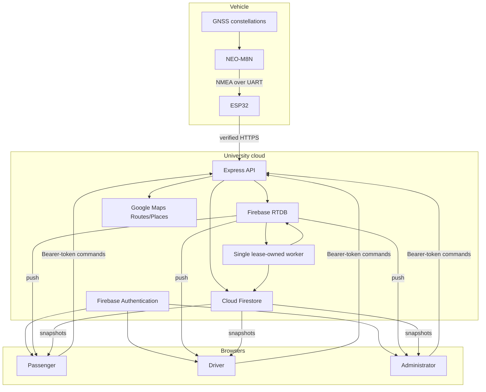

# High-level design (HLD)

## Scope and goals

Eki tracks a bounded university bus fleet in near real time, enforces ordered route progress, survives common connectivity/process failures, and exposes distinct passenger and administrator experiences. Administrators perform ride operations for assigned fleet operators. It is a modular monolith, not a multi-tenant platform: one deployment is attached to one Firebase project and one operational authority.

Primary goals are trustworthy hardware-derived location, simple operations, low Firebase cost, privacy-aware durable history, and recovery without asking a driver to reconstruct an interrupted ride. Non-goals are public transport ticketing, safety-critical vehicle control, offline authoritative dead reckoning, arbitrary multi-campus tenancy, and a high-volume event warehouse.

## Context

## Containers and responsibilities

| Container | Responsibility | Does not do |
|---|---|---|
| ESP32 firmware | Parse GNSS, validate fix quality, classify motion, choose publish timing, authenticate and push HTTPS | Choose bus/route, access Firebase, advance stops |
| Express backend | Authenticate people/devices, validate commands, maintain registry/assignments, write authoritative server data, health/metrics | Render UI, trust client lifecycle values |
| Trip-state worker | Consume live RTDB changes, enforce ordered geofences, persist recovery/history, sweep stale state, run retention/privacy jobs | Ingest unauthenticated devices |
| RTDB | Latest low-latency live projection and server-only assignment mirror | Durable history or device secrets |
| Firestore | Identity profile data, fleet/route configuration, recovery, locks, messages, feedback and history | High-frequency coordinate stream |
| Next.js PWA | Role-specific maps/workflows, pushed live views, client-authorized messaging/feedback | Authoritative GNSS/lifecycle mutation |
| Google Maps APIs | Admin-only place search and route geometry computation; browser map tiles | Per-fix ETA/directions calls |

## Core flows

### Telemetry

1. GNSS emits NMEA at 9,600 baud; the ESP32 parses it continuously.
2. Firmware rejects stale/poor-HDOP fixes, applies motion hysteresis, and publishes only on material change or heartbeat.
3. The device posts an eight-field body and `Authorization: Device …` over CA-verified HTTPS, including capture/send times and a queue sequence.
4. Express enforces request size, exact schema, timestamps, sequence, device/IP rate limits, scrypt credential verification, and protected registry assignment.
5. An RTDB transaction rejects older/duplicate timestamp-sequence pairs and writes `activeBuses/{busId}_{routeId}` with server receive/commit times.
6. A per-node asynchronous matcher preserves `rawLocation`, scores candidates on the direction-specific route using distance, heading and continuity, and publishes a version-bound `matchedLocation` without delaying the device response.
7. Two ordinary reliable moving deviations, or one measured deviation at least 120 m from the route, trigger one asynchronous live reroute through the remaining required stops. Missing matches are never treated as severe. Live routing uses `TRAFFIC_AWARE` with a 3.5-second budget; the active route switches atomically and stale cache-generation/request/version/session results are discarded.
8. If live lifecycle fields are missing, the backend asynchronously restores them from `active_rides` without delaying the response.
9. Browser singleton listeners receive the RTDB change. Confident current-version matches drive markers; a new on-route sample briefly retains its previous match while matching is pending, then falls back to visibly uncertain accepted raw GNSS after a fixed bound. Off-route and changed-route contexts use raw coordinates immediately. The service worker never caches authenticated responses.

### Ride start and progression

1. Firebase Auth custom claims identify a driver and assigned bus.
2. The start API rechecks Firestore driver/bus/route assignment and requires fresh hardware coordinates.
3. A Firestore transaction creates `ride_sessions/{sessionId}` and `_active_bus_locks/{busId}`. The deterministic lock makes cross-route starts mutually exclusive.
4. An RTDB transaction claims the bus/route node for that session; failure conditionally releases the lock and records a failed session.
5. The leader worker compares each new fix with only the next expected stop. It records stop evidence and lifecycle deltas, not every coordinate, in Firestore.
6. Final-stop completion transactionally writes `completed_trips`, completes `ride_sessions`, and conditionally deletes matching recovery/lock records. The RTDB completion write is also conditional on the session ID, preventing an old handler from corrupting a new ride.

### Interruption and recovery

- Device/network/GNSS loss: RTDB retains the active session and is marked offline/lost after the configured stale window; Firestore recovery remains.
- Backend restart: a Firestore lease selects one worker; RTDB subscriptions reattach. Telemetry can restore missing live lifecycle from `active_rides`.
- Browser background/offline: shared listeners resume on visibility/online changes; expired non-active positions are pruned. Authenticated data is never served from the service-worker cache.
- Abandoned session: the leader rechecks RTDB and Firestore activity transactionally, marks genuinely stale sessions `interrupted`, and conditionally removes matching recovery/lock state.

## Architecture decisions

| Decision | Reason | Trade-off |
|---|---|---|
| HTTPS device push, no broker | Small fleet, simplest observable trust boundary | Backend endpoint availability is directly on the path |
| RTDB for current position | Push semantics and inexpensive latest-value model | No built-in durable event history |
| Firestore for durable state | Transactions, rules, queries and recovery | More complex dual-store consistency |
| One lease-owned worker | Avoid duplicate stop progression/cleanup across API replicas | Lease/worker health must be monitored |
| Server registry supplies bus/route | A stolen device secret cannot choose another vehicle | Provisioning becomes an operational dependency |
| Ordered server geofences | Prevent browser/driver manipulation and stop skipping | Accuracy depends on route/stop quality and GNSS |
| Stored polylines/client ETA math | Avoid runtime Directions/Routes billing and latency | ETA is heuristic, not traffic-routing output |
| Independent forward/reverse geometry | Respect one-way roads and divided carriageways | Two Routes calls when route geometry is created/repaired |
| Backend matching plus multi-sample rerouting | One authoritative context for every client without reacting to one noisy fix | Genuine deviations require a short confirmation window |
| No dead reckoning as truth | Prevent fabricated locations during GNSS loss | UI shows interruption rather than a guessed moving bus |

## Security and privacy model

- Trust levels: Admin SDK backend > authenticated role claims > device registry credential > untrusted request payload/UI state.
- Browser REST uses Firebase ID tokens with revocation-aware bounded caching; admin and driver assignments are rechecked server-side.
- Device secrets are random per device, scrypt-hashed with salt, timing-safe compared, negatively cached briefly, and absent from logs/responses.
- Firestore/RTDB are default deny. `devices`, `active_rides`, `_active_bus_locks`, worker/privacy/operation internals, and live writes have no client permission.
- Passenger manifests are readable only to the session operator/admin. Messages are session-scoped, sender-bound, length-limited, and transactionally rate-limited. Feedback has a 24-hour cooldown.
- Account deletion is queued server-side. Production refuses to start unless `RETENTION_SWEEPER_ENABLED=true`; development and tests remain non-destructive when the setting is omitted.
- Hosting applies CSP, HSTS, anti-framing and content headers; CSP script hashes are regenerated after the static build.

## Performance and availability budgets

The software does not promise an absolute end-to-end SLA without real deployment measurements. Designed contributors are:

| Stage | Bound/behavior |
|---|---|
| GNSS evaluation | 1 second |
| Changed-fix floor | 3 seconds |
| Moving/stopped heartbeat | 1 / 5 seconds |
| HTTPS request timeout | 7 seconds |
| Retry | 1–30 seconds exponential with per-device jitter |
| RTDB write | One ordered live-node transaction per accepted new sample; one shared rate-budget transaction per bounded token lease |
| Firestore lifecycle | Only state/stop/delay/session changes |
| Browser live stream | One shared RTDB listener per browser runtime |
| UI freshness clocks | 15–60 second local-only timers; no API polling |

Admin-only `GET /api/health` returns rolling p50/p95/p99 processing, device-to-server, RTDB-write, and authenticated rate-limit decision latency plus credential cache efficiency and shared limiter transaction/retry counters. Public `GET /health` exposes readiness only. A device clock anomaly over 24 hours is excluded from the device-to-server window.

## Deployment view

The static frontend is deployed to Firebase Hosting. The Express container/runtime must expose managed HTTPS near the Firebase region and use Application Default Credentials/Workload Identity or a secret-managed service-account JSON. It should sit behind university WAF/global rate limits. The worker lease supports multiple API replicas while keeping one background owner.

The vehicle needs a fused 12 V-to-5 V converter, stable ground, secure enclosure/cabling, a clear-sky antenna, and cellular/Wi-Fi access. The fleet build embeds device-specific configuration, enables Secure Boot V2 and release-mode flash encryption, and refuses operation if either protection is inactive; its irreversible first boot still requires the witnessed spare-board procedure. Fleet application updates use two signed slots, an authenticated backend gate that withholds releases during active rides, exact size/SHA-256 verification, and rollback unless authenticated backend health succeeds. Controlled key custody, immutable hosting and spare-board update/rollback proof remain deployment prerequisites.

## Residual risks

- Physical GNSS multipath, antenna/power faults and cellular dead zones require route testing.
- General API rate limits are sharded per process and still require university edge limits. Authenticated device limits use the shared RTDB budget by default; local mode is restricted to an explicitly single-instance deployment.
- Firebase and Google Maps quotas/regions are external operational dependencies.
- A pinned CA must be physically updated before issuer expiry/rotation; application OTA deliberately cannot replace trust roots or credentials.
- Retention/privacy periods need university legal approval and backups need an owned restore drill.
- The PWA is static/client-heavy; first map load depends on Maps/Firebase network availability.
