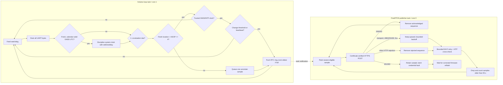

# Hardware telemetry, latency and failure design

Setup boundary: use [the hardware setup guide](README.md) before reading this
design. It is the source for required `backend/.env`, frontend environment
templates, `hardware/include/secrets.h`, signing-key custody, provisioning
order, route-specific changes, wiring, build selection, and post-flash checks.
This document is the source for runtime telemetry behavior, timing, failure
handling, latency and physical acceptance.

## Electrical and physical setup

| ESP32 | NEO-M8N | Purpose |
|---|---|---|
| `5V/VIN` | `VCC` | Regulated 5 V supply (confirm module voltage) |
| `GND` | `GND` | Common reference |
| `GPIO16 / RX2` | `TX` | NMEA into ESP32 |
| `GPIO17 / TX2` | `RX` | Optional configuration channel |

Use a fused automotive-rated 12 V-to-5 V buck converter, strain relief, protected enclosure, stable ground and clear-sky active antenna placement. Do not power an uncertain-voltage GNSS board from 5 V without checking its specification. A separate operator—not the driver—must observe the system while moving.

## Firmware build contract

- Development: `esp32dev`, Arduino, `huge_app.csv`; OTA compiled disabled.
- Fleet: `esp32dev-secure`, Arduino as an ESP-IDF component, Secure Boot V2, release-mode flash encryption, ROM-download lockdown, RAM-only Wi-Fi state, and a bootloader-safe custom partition table.
- Pinned platform/libraries: Espressif32 7.0.1, TinyGPSPlus 1.1.0, ArduinoJson 7.4.3.
- Runtime configuration: Wi-Fi, device ID/base64url secret, backend origin, and issuing root CA are compiled from the ignored `hardware/include/secrets.h` and validated before networking starts.
- There is no local configuration portal or persistent Eki credential store. Configuration replacement requires a new firmware image and physical reflash.
- Fleet runtime refuses to start networking unless flash encryption and Secure Boot both report active; fleet builds also reject non-HTTPS backend origins.

## Runtime tasks

The two tasks share only short critical sections around the fixed-capacity ring and fault counters. TLS can consume its full connect/request timeout without delaying NMEA parsing. The 8,192-byte UART buffer remains as protection against scheduler and diagnostic jitter, while HardwareSerial buffer/FIFO overflow callbacks and TinyGPSPlus checksum failures make any loss observable.

Fresh TinyGPSPlus date/time (maximum two-second age, strict calendar/range validation) is converted without timezone-sensitive `mktime` and applied using `settimeofday`. This establishes TLS-valid time before Wi-Fi/NTP is available and corrects drift of at least 1.5 seconds no more than once per minute. Once Wi-Fi connects, SNTP is scheduled as a six-hour cross-check/fallback. GNSS remains the primary discipline source; invalid/stale GNSS time is never applied.

The 100-sample queue occupies 5,648 bytes of RTC no-init memory. At the maximum one capture per second it covers 100 seconds; heartbeats consume less. It survives software/watchdog resets, rejects recovery when the device/backend identity or queue layout changes, and drops the oldest entry on overflow. The backend accepts timestamps only within 60 seconds, so recovery sends newest-first and purges entries outside a 55-second safety margin rather than replaying invalid data. A successful newest-fix acknowledgement also compacts every older superseded sample, preventing stale duplicate traffic from consuming the one-second delivery budget.

## Fix quality and transmission parameters

| Parameter | Value | Purpose |
|---|---:|---|
| Evaluation period | 1 s | Consume current GNSS state |
| GNSS age maximum | 5 s | Reject stale parser fixes |
| Short-gap jump margin | Adaptive 15–50 m receiver error plus reported-speed reach | Reject fragmented/cached fixes after brief signal loss |
| Position reacquisition | after 5 min without an accepted anchor | Permit legitimate relocation after a prolonged outage |
| HDOP maximum | 4.0 | Reject poor horizontal geometry |
| Moving enter / stopped enter | 2.5 / 1.5 km/h | Hysteresis against jitter |
| Confirmation readings | 3 consecutive qualifying 1 s evaluations | Stable motion classification; neutral-band noise cannot complete a pending transition |
| Minimum changed capture | 1 s | Low-latency upper bound on queue/write frequency |
| Distance change | 5 m | Position materiality |
| Heading change | 15° | Direction materiality |
| Speed change | 5 km/h | Velocity materiality |
| Moving/stopped heartbeat | 1 / 5 s | Live movement plus fresh stopped endpoint state |
| HTTP connect/request timeout | 7 s | Bound blocked network work |
| GNSS UTC maximum age | 2 s | Reject stale date/time sentences |
| GNSS correction | >=1.5 s, at most once/minute | Primary clock discipline without rapid jumps |
| NTP cross-check | startup after Wi-Fi, then six-hour schedule | Independent fallback/check; not a publish dependency |
| Wi-Fi retry | 5-60 s exponential | Bound radio churn while retrying indefinitely |
| HTTPS retry | 1–30 s + up to 1 s jitter | Recovery without fleet retry storm |
| RTC queue | 100 samples / 5,648 bytes | Bounded store-and-forward with oldest-drop overflow |
| Queued-fix discard | >55 s | Stay within backend freshness window |
| Task watchdog | 25 s, panic/restart | Cover both tasks and bounded connect-plus-request latency |
| Remote diagnostics | first at 30 s, then every 5 min while no fresh telemetry is queued | Authenticated bounded health without delaying a queued fix or retry recovery |
| NMEA no-data warning | after 5 s, every 5 s | Wiring/baud diagnosis |

Wi-Fi persistence is disabled before the driver starts, auto-reconnect is enabled, the strongest known AP is selected with fast scan, and modem sleep is disabled because the tracker is vehicle-powered and latency is preferred over battery life. Outages retry indefinitely with bounded exponential delay; the firmware never starts a soft AP or HTTP server. A credential fault disables the station radio and GPIO2 emits three short pulses every two seconds until corrected firmware is flashed. Fleet builds require release-mode flash encryption and Secure Boot, and explicitly disable ESP32 Wi-Fi key-value persistence.

Deterministic UTC conversion/discipline lives in `hardware/include/clock_policy.h`; Wi-Fi retry and LED behavior in `hardware/include/connectivity_policy.h`; compile-time secret validation in `hardware/include/firmware_config.h`; distance, heading, motion hysteresis, HTTP outcomes and capture decisions in `hardware/include/telemetry_policy.h`; and queue ordering/recovery in `hardware/include/telemetry_queue.h`. Pure policies are executed on the host by `platformio test -d hardware -e native`. Radio, UART, antenna, TLS, watchdog and power behavior remain physical acceptance concerns.

## Payload and HTTP outcomes

The body fields and limits are defined in [Firebase data model](../data/FIREBASE_DATA_MODEL.md#activebusesbusid_routeid) and [Backend API](../backend/API.md). Each captured fix includes receiver HDOP so off-route confirmation can reject poor-quality evidence; GNSS fixes above HDOP 4 are already rejected on-device. The device treats only 200/202 as telemetry success. A success removes the acknowledged fix plus older superseded fixes, while preserving any newer fix captured during the request. Transport errors, 408/425/429 and 5xx retain the attempted sample for retry; other permanent HTTP statuses remove only that sample. HTTP 401/403 retains the rejected sample, latches a credential fault, disables the station radio, and requires a corrected firmware reflash so a doomed secret cannot create an infinite loop. Normal freshness eviction still prevents an old retained sample from violating the backend's timestamp contract. HTTP 429 honors the bounded delta-seconds `Retry-After` value. If a newer fix arrives during a retryable request, it becomes the next recovery candidate. Remote diagnostics is a separate best-effort 1 KiB POST containing only bounded counters/state; its failure never evicts or delays a queued fix.

## Trace evidence and gap classification

The configured baseline is a one-second evaluation and moving heartbeat, a one-second stopped heartbeat, three consecutive qualifying motion readings, and a one-second connect/TLS handshake limit and 1.5-second HTTP read timeout. These are separate phase limits, not a total request deadline. Validate the shorter budgets with route traces and staging latency measurements. The serial log records each accepted request duration, retry number/delay, stale-queue eviction, and a periodic `Telemetry Evidence` line containing capture, attempt and retry totals, capture/accept ages, queue depth, and remaining retry delay.

Treat a gap as intentional only when `captureSeen=1`, `captureAgeMs` is within the selected heartbeat for the confirmed motion state, and the queue/retry indicators are clear. If `captureAgeMs` exceeds that heartbeat, investigate GNSS capture or fix quality first. If capture remains current, a growing `acceptedAgeMs`, non-zero queue, retry delay, stale drop, transport error, or rejected count is a delivery problem. The extra evidence remains serial-only while backend capacity work decides which additional diagnostic fields can be stored without changing the closed authenticated diagnostics schema.

| Symptom | Likely cause | Action |
|---|---|---|
| No NMEA warning | RX/TX reversed, no GNSS power, wrong baud | Check wiring/LED/serial at 9,600 |
| Never gets valid fix | Indoor/multipath antenna, HDOP >4 | Move antenna to sky view; inspect GNSS output |
| Clock not synchronized | Stale/invalid GNSS date-time and NTP blocked | Check NMEA date/time freshness; then Wi-Fi/DNS/UDP |
| Boot halts on compile-time configuration | Missing/invalid value in `secrets.h` | Correct the named field, rebuild, and reflash |
| Fleet firmware halts at security gate | Flash encryption or Secure Boot inactive | Quarantine the unit; repeat only the witnessed spare-board procedure, never bypass the gate |
| Negative HTTPClient/transport failure | DNS/backend unreachable, wrong hostname/CA, expired issuer, bad clock | Use the printed transport string; verify URL chain and NTP; never use insecure mode |
| HTTP 400 | Firmware/backend contract mismatch or timestamp/range | Compare the deployed schema (nine-field current; eight-field sequenced and six-field legacy compatibility), sequence, and clock |
| HTTP 401/403 + three LED pulses | ID/secret disabled/mismatched or assignment invalid | Rotate/inspect registry, update `secrets.h`, build a protected artifact, and reflash |
| HTTP 429 | IP/device limiter | Check publish loop/config and WAF limits |
| HTTP 503/timeouts | Backend/Firebase/network outage | Inspect `/health`; backoff retains the bounded queue |
| Repeated watchdog reset | HTTP/network stack longer than 25 s or task fault | Inspect reset reason/serial; verify 7 s connect/request timeouts |
| Non-zero overflow counters | GNSS task starvation, UART pressure or full telemetry queue | Inspect authenticated remote diagnostics; reproduce against network outage and load |
| `uncertain` on map | One GNSS-loss notification at last trusted point | Fix antenna/sky view; no guessed motion is shown |

## Latency analysis

The device serial line is not the normal bottleneck: NMEA parsing continues while HTTPS blocks the publisher task. While moving, designed latency is up to one-second evaluation plus network/TLS/API/RTDB time; the one-second publish floor prevents duplicate bursts without deliberately adding multi-second lag. On recovery the newest eligible state is restored first. Stationary heartbeats arrive every second so endpoint arrival and automatic turnaround do not race the backend's 60-second freshness gate.

Admin-authenticated backend `/api/health.telemetry` provides:

- `processingLatencyMs`: API service processing, including credential/RTDB work.
- `deviceToServerLatencyMs`: server receipt minus device GNSS/NTP-disciplined timestamp; includes sampling gate and network but is trustworthy only with a correct clock.
- `rtdbWriteLatencyMs`: RTDB transaction duration.
- `credentialCacheHitRate`, accepted/rejected counters and last times.

Each latency is a rolling in-process 512-sample window with average/p50/p95/p99. Measure these on the actual route along with GNSS fix age, cellular RTT, browser display time and RSSI. A server restart intentionally resets metrics.

## Points of failure and mitigations

| Point | Detection | Software behavior | Remaining action |
|---|---|---|---|
| Vehicle power/buck/cable | Board resets/no telemetry | Reset reason logged; durable ride retained | Automotive wiring/spares/monitoring |
| GNSS receiver/antenna/UART | No NMEA, quality rejection, checksum or UART overflow count | Warning; one uncertain sample; 30 s counters | Physical inspection/route survey |
| Wi-Fi/hotspot | Disconnect/RSSI/timeouts | Exponential retry and RTC queue | Coverage/SIM/hotspot redundancy; reflash if credentials change |
| Clock | No TLS/invalid timestamp | Fresh GNSS UTC primary; NTP cross-check/fallback; no invalid publish | Validate receiver UTC and NTP paths on target hardware |
| TLS CA rotation | TLS failure | Fail closed | Controlled physical trust-root reflash before issuer expiry |
| Signed OTA | Manifest withheld during active ride; candidate pending validation | Idle/stopped local gate, exact size/SHA-256, Secure Boot signature and dual-slot rollback | Prove wrong-key/digest rejection and five-minute rollback on spare boards |
| Device credential | 401/403, rejected metric, three-pulse LED | Publishing latches off and station radio stops | Rotate registry secret, reflash complete config, verify diagnostics |
| Hardware security | Boot gate and remote diagnostic booleans | Fleet firmware halts unless both protections are active | Witness first boot and retain spare-board evidence |
| Backend/Firebase | 503/latency metrics | Bounded queue retained; jitter retry | Regional managed runtime/alerts |
| Process restart | health/worker lease | Durable active ride and reconnect | Runbook/availability deployment |
| GNSS gap | uncertain/stale UI | No dead-reckoned authoritative point | Accept interruption or add separately-labelled estimate only after safety review |

## Security deployment

The `esp32dev-secure` environment builds a signed Secure Boot V2 image with release-mode flash encryption, ROM-download lockdown, two OTA slots and bootloader rollback. Its first boot irreversibly provisions security eFuses, so repository automation never uploads it. Because credentials are embedded in the application image, configuration must happen only in the approved encrypted signing environment and plaintext/unprotected artifacts must never be archived. Follow the witnessed [fleet security and provisioning procedure](../operations/HARDWARE_SECURITY_PROVISIONING.md) on spare ECO3-or-newer boards, retain first-boot plus signed update/rollback evidence, and only then approve production units.

## Physical acceptance

Bench compile is necessary but insufficient. Test cold/warm GNSS acquisition, stationary drift, urban multipath, tunnel/covered loss, Wi-Fi loss/recovery, backend outage/recovery, power cycling during active ride, CA/credential rejection, long HTTP failure, every route geofence in order, and final completion. Verify Wi-Fi credentials are never recovered after reflashing a different `secrets.h`, no soft AP or port-80 listener appears during outages, a 401/403 drops STA and latches the three-pulse fault, and only a corrected signed reflash restores publishing. Record p50/p95/p99 display latency, serial reset/failure logs, commit, firmware hash, route/weather and evidence.
